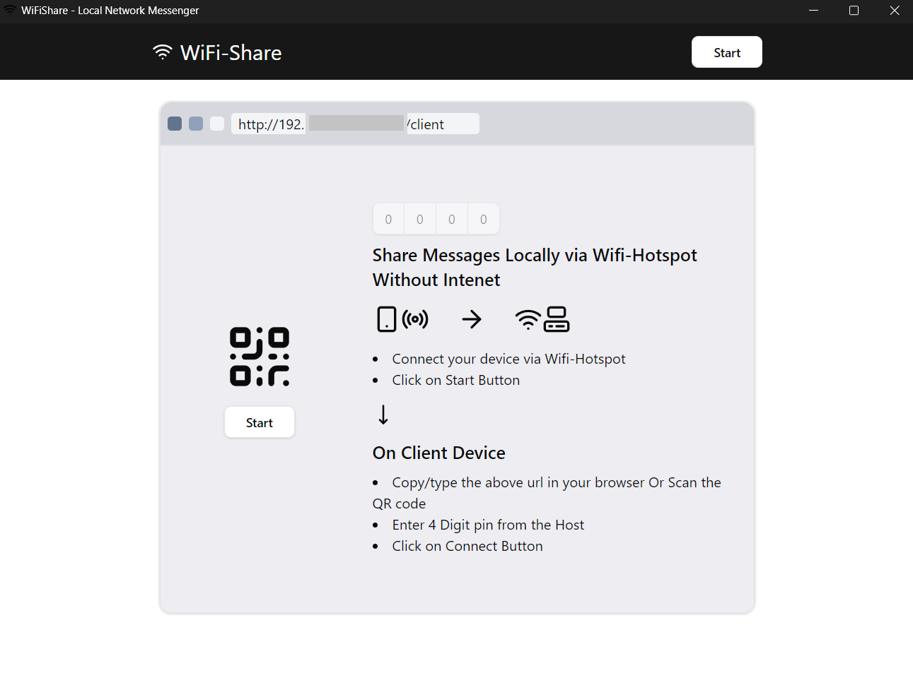

  

  <h1>Wifi Share</h1>

Transfer files and Messages over local wifi network without internet.

 
 

## Features

- 🚀 Transfer files over Wifi without Internet.
- ⚡️ Blazing fast transfer speed.
- 🏷️ Free and Open Source
- 🌱 Friendly UI

## Prerequisite to Download wifi-share

- [Edge Browser](https://www.microsoft.com/en-us/edge/?ch=1&form=MA13FJ) (installed on your system)
- [Node js](https://nodejs.org/en) (optional)

## Download

The Download is Available with or without node.

| Download                | Windows 10+                                  | Description             |
|-------------------------|----------------------------------------------|-------------------------|
| With Node js Bundled    | [Download 19.3MB](https://github.com/iamvkr/wifi-share/raw/refs/heads/main/BuildSrc/wifi-share%20setup.exe) | Use if node js is not installed on your system     |
| Without Node            | [Download 2.87MB](https://github.com/iamvkr/wifi-share/raw/refs/heads/main/BuildMin/wifi-share%20setup.exe) | Use if node js is already installed on your system |

## The problem:
Most of the time we want to transfer some messages from my phone to pc or the other way, but we either have to use some chat app like WhatsApp on web and phone which uses internet.
Or, for file transfer we need USB cables.

To solve the above problem, I wanted to build a product that solves this issue. So I used AI to get an action plan ready and implemented using JavaScript.

The transfer takes place through local wifi network and without using internet.

It uses technology like node js and express to create a local server and socket I.O for real-time connection.

### Development & Build

Development and Build instruction are available at:
- [Frontend](/Frontend/README.md)
- [Backend](/Backend/README.md)
- [Build-Bundled](/BuildSrc/README.md)
- [Build-Min](/BuildMin/README.md)

## Usage

1. Connect your devices with wifi and hotspot.
2. Click start button to start Host
3. On Client device, Scan the QR code or type the client url in client device
4. Enter the pin provided by host.
5. Click on connect to connect to Host
6. Now you can easily transfer files and messages.

#### Note:

- Make sure to allow access through your Firewall.

- The transfer of files and messeges takes place via `http` protocol. Make sure you are on a `private` or a `trusted` wifi Network.

### Screenshots

<!--  -->

<!--  -->

## Contributing

Contributions are always welcome!

## License

[GPL](./LICENSE) © iamvkr