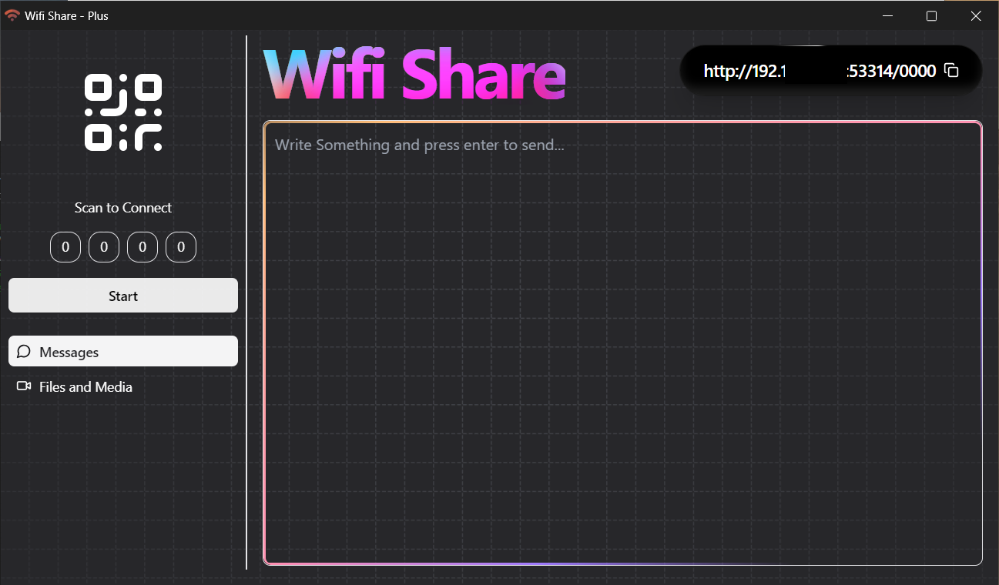

<p align="center">
  
</p>

<div align="center">
  <h1>Wifi Share</h1>
</div>
<p align="center">Transfer files and Messages over local wifi network without internet.</p>

<p align="center">


<a href="https://opensource.org/licenses/"></a>
</p>

<p align="center">


</p>

<br />

## Features

- 🚀 Transfer files over Wifi without Internet.
- ⚡️ Blazing fast transfer speed.
- 🏷️ Free and Open Source
- 🌱 Friendly UI

## Prerequisite to Download wifi-share

- [Edge Browser](https://www.microsoft.com/en-us/edge/?ch=1&form=MA13FJ) (usually pre installed on your system)
- [Node js](https://nodejs.org/en) (require v20+)

## Download

The Download is Available with or without node.

| Download for Windows 10+ 64-bit              | Description             |
|----------------------------------------------|-------------------------|
| [Download 1.94 MB](https://github.com/iamvkr/wifi-share/raw/refs/heads/main/Export/wifi-share%20setup.exe) | Setup installer for Wifi Share     |


## The problem:
Most of the time we want to transfer some messages from my phone to pc or the other way, but we either have to use some chat app like WhatsApp on web and phone which uses internet.
Or, for file transfer we need USB cables.

To solve the above problem, I wanted to build a product that solves this issue. So I used AI to get an action plan ready and implemented using JavaScript.

The transfer takes place through local wifi network and without using internet.

It uses technology like node js and express to create a local server and socket I.O for real-time connection.

## Usage

1. Connect your devices with wifi and hotspot.
2. Open the app. The required modules are downloaded.
3. Server starts and app is initialized.
2. Click start button to start Host
3. On Client device, Scan the QR code or type the client url in client device to connect to Host.
4. Now you can easily transfer files and messages.

#### Note:

- Make sure to allow access through your Firewall.

- The transfer of files and messeges takes place via `http` protocol. Make sure you are on a `private` or a `trusted` wifi Network.

## Development & Build

The tech stack to build this app: 
- [Vite-Express](https://www.npmjs.com/package/vite-express): (for development) With vite-express you can just start writing full-stack app in seconds.
- Inno setup : Package app as an executable.

### Tech Stack


### Instructions:

Install dependencies

```bash
  npm install
```

Note:set the configuration in  `src/client/config/conf.js`

Start the server

```bash
  npm run dev
```

Build for production

```bash
  npm run build
```
## Build

- Make sure to run build command before packing.
- Open the `wifi-share-build-script-min.iss` in inno steup.
- Make required changes
- Compile the project
- A setup will be genetated which will install the wifi-share software.


### Screenshots




## Contributing

Contributions are always welcome!

## License

[GPL](./LICENSE) © iamvkr